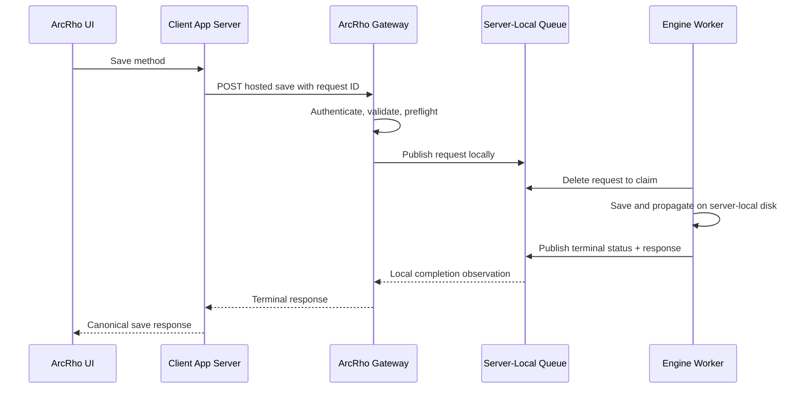

# Hosted Save HTTP Transport

Status: Implemented for every hosted-save kind; TLS, traffic limits, and
retiring the SMB path remain
Last updated: 2026-09-07

## Summary

Engine-hosted saves used to be coordinated through small JSON files on the
ArcRho Server share. The design was correct, but a Client PC paid full
mapped-drive latency for every metadata check, write, rename, and status read —
around 2.5–2.9 s per save, with worse outliers.

`ArcRho Gateway` now carries those saves over HTTP. The client posts one
request to the Gateway; the Gateway performs the preflight, publishes the same
Engine request on server-local disk, watches for completion locally, and
returns the canonical save response. No canonical save logic, reserving-class
lease, or dependent-propagation behaviour changed — only the transport between
the client app server and the Engine.

The SMB protocol is still in the client and is still the rollback path. It is
retired only once the Gateway runs over TLS.

## What Was Built

- **Every save kind, derived not configured.** The supported kinds come from the
  canonical `SAVE_JOB_KINDS` registry, so a new save procedure joins the HTTP
  transport with no Gateway configuration change: DFM, Result Selection,
  Bornhuetter Ferguson, Cape Cod, Bootstrap, Berquist Sherman, dataset
  sidecars, and the Excel link retarget. Save routes and their `/plan` siblings
  are unchanged; the browser still calls its local app server.
- **One supervised server executable.** Every logged-in user's Orchestrator
  restores the Gateway from `apps.gateway.auto_create_instance`. The first
  process to bind the fixed port owns the listener and later copies exit, which
  requires the Gateway to refuse address reuse — Python's `HTTPServer` default
  would otherwise let two processes split the traffic. The same process also
  serves hosted workspace reads, mutations, and engine calculations; see
  [hosted_workspace_http_transport.md](hosted_workspace_http_transport.md).
- **Idempotent by receipt.** A receipt is written before Engine publication and
  binds the request ID to the canonical request SHA-256. A replay of the same ID
  returns the stored outcome; different content under the same ID returns `409`.
  Terminal receipts are pruned on a retention window.
- **Capability negotiation.** A client asks `/api/capabilities` which kinds a
  Gateway serves and keeps anything an older deployment does not advertise on
  SMB, so a pending Gateway upgrade degrades the transport instead of failing
  the save. Once a local HTTP credential exists, an uncertain HTTP submission
  never falls back to SMB.
- **Automatic enrollment.** `%APPDATA%\ArcRho\arcrho_gateway.json` is the
  per-user flag and credential. A missing file triggers enrollment on startup
  and after Server Connection changes, when the shared configuration has a
  `client_url` and the endpoint answers a probe. An existing file is
  authoritative, `enabled: false` included; invalid configuration fails
  explicitly rather than falling back silently.
- **First-time server setup.**
  `py -3.10 server-components/src/arcrho_gateway/configure_pilot.py --user <login> --url <gateway-url>`
  records the canonical client URL, updates the server registry, installs that
  user's credential without printing the secret, and removes the pilot-era HKCU
  Run entry. Other users are enrolled automatically.
- **Comparable measurements.** Client latency records carry `transport` as
  `smb` or `http_gateway` in `client_save_latency.jsonl`.

## Routes

| Route | Purpose |
| :--- | :--- |
| `POST /api/hosted-saves` | Submit the existing logical `ArcRhoHostedSave` payload with a request ID. |
| `GET /api/hosted-saves/{request_id}` | Read `accepted`, `processing`, `success`, or `error`, with the canonical response or error on a terminal state. |
| `POST /api/hosted-save-progress` | Progress for a save in flight. |
| `GET /api/capabilities` | Which save kinds this Gateway serves. |
| `GET /api/health` | Liveness. |

The payload carries logical project and reserving-class names, never absolute
paths; the Gateway rejects anything else. Server-Sent Events were considered
and dropped: short-interval polling is far cheaper than SMB polling already and
keeps the client simple.

## Failure Handling

| Situation | Behaviour |
| :--- | :--- |
| Rejected before acceptance | The client may retry the same request ID. |
| Uncertain acceptance | The client recovers by the same request ID over HTTP, never by falling back to SMB. |
| Same ID, same content | The stored receipt, status, or result is returned. |
| Same ID, different content | `409`. |
| Engine unavailable before acceptance | `503`; nothing is queued. |
| Reserving class held | `423`. |
| Gateway restarts | Accepted and terminal receipts survive on server-local disk. |
| Engine crashes after claim | The existing processing timeout applies and the editor keeps unsaved state. |

## The SMB Baseline

Measured on project `NJ_Annual_Prod_202605_Fake`, reserving class
`PRNJ - PA\PA\All States\Direct Group\COL`, before the Gateway:

| Observation | Total | Preflight | Request publish | Remote polling | Status reads |
| :--- | ---: | ---: | ---: | ---: | ---: |
| Original C22 SMB protocol | 4,686 ms | 579 ms | 644 ms | 1,988 ms | 1,273 ms / 3 reads |
| Optimized C22, cold path cache | 2,875 ms | 588 ms | 654 ms | 1,631 ms | 766 ms / 2 reads |
| Optimized C12, warm path cache | 2,458 ms | 197 ms | 644 ms | 1,585 ms | 708 ms / 2 reads |
| Slow C22 outlier | 5,015 ms | 229 ms | 1,550 ms | 3,235 ms | 1,648 ms / 4 reads |

Local CPU work was negligible. The cost was roughly 640–1,550 ms to publish one
request, 350–490 ms per status read, the polling detection delay, and about
200 ms of warm-cache preflight that still touched the share. The Gateway
removes all of it from the client's critical path, leaving Engine execution
time plus ordinary HTTP latency.

## Remaining Work

- **TLS.** Traffic is plain HTTP with an HMAC credential per user on the
  controlled internal network. HMAC prevents credential disclosure and payload
  tampering, but dataset and method content is not encrypted. Production
  rollout requires HTTPS, which also settles certificate issuance, hostname,
  and renewal ownership — server operations, not individual clients.
- **Traffic limits.** Per-user and global concurrency limits are not
  implemented. Request and response size caps are.
- **Retiring the SMB transport.** Only after the fleet runs the TLS Gateway and
  the rollback criteria are met.

## Invariants To Preserve

- Save routes keep their request and response shapes.
- The Engine remains the only executor of canonical hosted-save work; no
  calculation or method-specific save logic belongs in the Gateway.
- Reserving-class leases and dependent propagation are untouched.
- Individual Engine worker ports are never exposed to clients.
- The authenticated identity, not a JSON `UserName`, is what sidecars and
  indexes record.
- A save is never executed twice because a response was lost.
